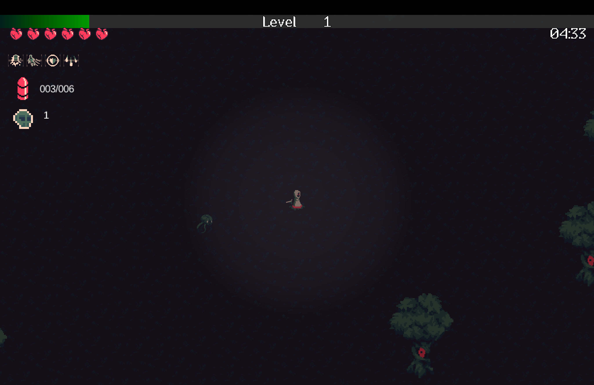

# 20MinutesTillDawn

A survival roguelike shooter game where you must survive for 20 minutes against waves of increasingly difficult enemies.
Fight against hordes of monsters, level up, gain abilities, and try to survive until dawn!



## Game Description

In 20MinutesTillDawn, you play as a character with unique abilities fighting against waves of enemies. The game
features:

- **Time-based Survival**: Survive for 20 minutes to win
- **Multiple Enemy Types**: Face different enemies including EyeBats, TentacleMonsters, Trees, and the powerful
  ElderBoss
- **Character Progression**: Level up and gain powerful abilities during gameplay
- **Weapon System**: Use different weapons with reload mechanics
- **Special Abilities**: Activate abilities like speed boosts, damage enhancements, shields, and multishot

## How to Play

- **WASD**: Move your character
- **Mouse**: Aim your weapon
- **Left Click**: Shoot
- **R**: Reload your weapon
- **Number Keys (1-9)**: Activate abilities
- **ESC**: Pause the game

## Platforms

- `core`: Main module with the application logic shared by all platforms.
- `lwjgl3`: Primary desktop platform using LWJGL3; was called 'desktop' in older docs.

## Gradle

This project uses [Gradle](https://gradle.org/) to manage dependencies.
The Gradle wrapper was included, so you can run Gradle tasks using `gradlew.bat` or `./gradlew` commands.
Useful Gradle tasks and flags:

- `--continue`: when using this flag, errors will not stop the tasks from running.
- `--daemon`: thanks to this flag, Gradle daemon will be used to run chosen tasks.
- `--offline`: when using this flag, cached dependency archives will be used.
- `--refresh-dependencies`: this flag forces validation of all dependencies. Useful for snapshot versions.
- `build`: builds sources and archives of every project.
- `cleanEclipse`: removes Eclipse project data.
- `cleanIdea`: removes IntelliJ project data.
- `clean`: removes `build` folders, which store compiled classes and built archives.
- `eclipse`: generates Eclipse project data.
- `idea`: generates IntelliJ project data.
- `lwjgl3:jar`: builds application's runnable jar, which can be found at `lwjgl3/build/libs`.
- `lwjgl3:run`: starts the application.
- `test`: runs unit tests (if any).

Note that most tasks that are not specific to a single project can be run with `name:` prefix, where the `name` should
be replaced with the ID of a specific project.
For example, `core:clean` removes `build` folder only from the `core` project.

## Installation and Running

### Prerequisites

- Java Development Kit (JDK) 8 or higher
- Git (optional, for cloning the repository)

### Steps

1. Clone or download this repository:
   ```
   git clone https://github.com/yourusername/20MinutesTillDawn.git
   ```
   Or download and extract the ZIP file from the repository.

2. Navigate to the project directory:
   ```
   cd 20MinutesTillDawn
   ```

3. Build the project:
   ```
   ./gradlew build
   ```
   or on Windows:
   ```
   gradlew.bat build
   ```

4. Run the game:
   ```
   ./gradlew lwjgl3:run
   ```
   or on Windows:
   ```
   gradlew.bat lwjgl3:run
   ```

## Technologies Used

- [libGDX](https://libgdx.com/): A cross-platform Java game development framework
- [LWJGL3](https://www.lwjgl.org/): Lightweight Java Game Library 3
- [Gradle](https://gradle.org/): Build automation tool

## Features

- **Save/Load System**: Save your progress and continue later
- **Multiple Characters**: Choose from different characters with unique abilities
- **Various Weapons**: Different weapons with unique characteristics
- **Progressive Difficulty**: Enemies become stronger and more numerous as time passes
- **Boss Battles**: Face the powerful ElderBoss
- **Level-Up System**: Gain experience and level up to become stronger

## Credits

- Game developed with libGDX
- Assets and sound effects imported from the original game
